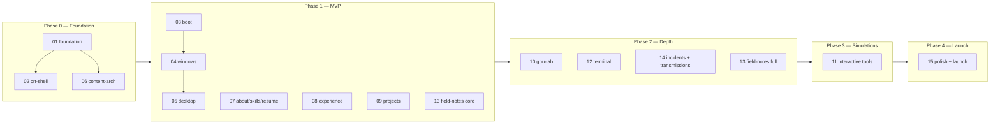

# 00 — Master Plan: ATHARVA.RUNTIME

> **This document is the root of the plan suite.** It locks the vision, the technical stack, the route map, the phase roadmap, and the vocabulary that every other plan document (`plans/01`–`plans/15`) references. The creative source of truth remains `plan.md` at the repo root; plans cite it by section number (e.g. §12.3). `plan.md` is never modified.

---

## 1. Mission

Build **ATHARVA.RUNTIME**: a portfolio website for Atharva Chandwadkar, AI Infrastructure / GPU Inference Engineer, styled as a 1994 CRT workstation (the **AC-90**) that turns out to be secretly connected to a 2026 AI inference datacenter (§1).

The central creative tension (§1):

> **A retro computer interface controlling a future-grade AI infrastructure system.**

Primary goal (§ preamble): make the visitor feel they discovered a classified, high-performance inference system built and operated by Atharva. Secondary goal: present real technical depth without sacrificing recruiter usability.

The finished site must satisfy the creative standard of §35:

```text
A 1994 workstation
running a 2026 AI datacenter
operated by an engineer
who understands every layer.
```

And the build principle of §38 governs every feature in every plan doc:

> Does this help the visitor understand Atharva's engineering depth, systems thinking, or impact? If not, remove it.

### 1.1 Identity vocabulary (§2)

These names are canonical across all docs, copy, and code:

| Term | Meaning |
|---|---|
| `AC-90` | The machine (CRT workstation, bezel label, BIOS name) |
| `ATHARVA.RUNTIME` | The operating system / site identity |
| `ATHARVA` | Current user |
| `AI INFRASTRUCTURE ENGINEER` | System role |
| `FIELD_NOTES` | The blog (recommended final name, §16.1) |
| `MEMORY.MAP` | The skills window (§13) |
| `PERFMON.EXE` | The performance dashboard (§14) |
| `AC-90 POCKET TERMINAL` | The mobile shell (§24) |

Brand statement (§36): **"I build the infrastructure that makes intelligence run."**

### 1.2 Tone (§3)

Feels: technically elite, mysterious, calm, intelligent, industrial, slightly playful, credible, deeply engineered.
Never: gamer aesthetic, neon overload, cyberpunk-for-its-own-sake, cluttered, fake-hacker, NVIDIA clone, generic dev portfolio.

### 1.3 Experience narrative (§4)

Five phases shape the entire UX and the plan suite's build order:

```text
DISCOVERY  → unpowered CRT, [ POWER ] button          (plans/03)
BOOT       → BIOS log, diagnostics, PRESS ENTER        (plans/03)
DESKTOP    → retro desktop, icons as navigation        (plans/05)
EXPLORATION→ windows, directories, 3D, simulations     (plans/04, 07–12)
CONNECTION → modem-style contact session               (plans/15)
```

---

## 2. Locked technical decisions

Every plan doc assumes these. **Do not re-litigate them inside subsystem docs** — if a decision must change, change it here first and propagate.

| Area | Decision | Rationale |
|---|---|---|
| Framework | **Next.js 15 (App Router), React 19, TypeScript strict** | §27 recommends Next.js + TS; App Router gives per-route code splitting for lazy 3D (§26) and server-rendered text (§26) |
| Styling | **Tailwind CSS v4** + CSS custom properties for phosphor design tokens (§22.1) | Tokens must be theme-switchable (green/amber/paper) at runtime; Tailwind v4 reads CSS variables natively |
| CRT effects | **CSS-first** (scanlines, dot pitch, curvature, bloom, flicker via CSS/SVG). WebGL postprocessing allowed **only inside GPU Lab's canvas** | §26 explicitly: "use CSS for scanlines instead of heavy postprocessing where possible" |
| 3D | **React Three Fiber + drei**; assets authored in Blender → GLB, Draco/meshopt compression, KTX2 textures; lazy-loaded per route | §23.2, §26, §27 |
| State | **Zustand** stores: `windowStore`, `bootStore`, `settingsStore` (display mode, sound, palette, motion), `telemetryStore` (decorative metrics). **URL is source of truth** — every window has a route (§6.2) | Small, no-provider, SSR-safe; URL routing satisfies SEO/sharing (§29) |
| Animation | **Framer Motion** for windows/UI; **GSAP timeline** for the boot sequence (§7.2); `prefers-reduced-motion` respected everywhere (§25) | GSAP timelines map 1:1 to the §7.2 timing table |
| Content | **MDX + Velite** (typed content layer). §27 says "CONTENTLAYER OR VELOCITY" — Contentlayer is unmaintained and "Velocity" is a typo for Velite; Velite is the maintained, Zod-schema equivalent | Schemas per §28 for experience, projects, blogs, incidents (+ transmissions) |
| Sound | **Web Audio API** wrapper (`src/lib/sound.ts`), muted by default, persistent toggle | §25: "sound disabled by default or clearly controllable" |
| Search | **Pagefind** (static index built post-build; zero backend) | §27 offers Pagefind or Algolia; Pagefind keeps the site fully static |
| Contact | **Resend** via a single route handler (`/api/contact`); degraded fallback is a `mailto:` link styled in-theme | §19; no backend server to operate |
| Analytics | **Plausible** (script in root layout, respects DNT) | §27 |
| Deploy | **Vercel**, preview deployment per PR, Lighthouse CI on previews | §27 |
| Fonts | Three-font system (§22.2): pixel/bitmap display font, monospace terminal font, readable body font — all self-hosted via `next/font` with fallback metrics to protect CLS | Exact font selection is delegated to `plans/01-foundation.md` §Typography |

### 2.1 Performance budget (§26) — enforced at every phase gate

```text
LCP............... < 2.5s
INP............... < 200ms
CLS............... < 0.1
INITIAL JS........ MINIMIZED (no three.js/GSAP in the shared bundle)
3D ASSETS......... LAZY LOADED (route-level dynamic import)
TEXT CONTENT...... SERVER RENDERED
BLOGS............. STATICALLY GENERATED
```

Hard rules derived from this budget:

- `three`, `@react-three/fiber`, `drei`, `gsap` are **never** imported in the root layout or any shared chunk. They enter only via `next/dynamic` inside the routes that need them (boot, gpu-lab, tools).
- All long-form content (about, experience, projects, blogs, incidents) renders as server components; interactivity is layered on top.
- Every 3D scene has a static-image or ASCII fallback (§26 "static fallback for low-power devices"), selected by the visitor-benchmark capability check (§21.7).

### 2.2 Accessibility baseline (§25) — non-negotiable in every doc's acceptance criteria

Full keyboard navigation; SKIP BOOT; reduced-motion support; CLEAN display mode; high-contrast mode; semantic HTML; visible focus states; descriptive labels; no color-only information; all 3D interactions duplicated in text; readable font sizes; blog content readable without heavy JS; no required sound.

---

## 3. Route map (§5.1, amended)

§5.1's route list is adopted with **two amendments**, required because §6.2 mandates "each window has a URL route for sharing and SEO" and two windows in the brief have no route:

1. **`/skills`** — the MEMORY.MAP window (§13).
2. **`/perfmon`** — the PERFMON.EXE dashboard (§14).

Final route map:

```text
/                      unpowered CRT → boot → redirects to /desktop (returning visitors land here directly)
/desktop               desktop home (windows open *over* the desktop; every window route renders desktop behind it)
/about                 ABOUT.EXE
/skills                MEMORY.MAP                       [AMENDMENT]
/experience            EXPERIENCE.DIR
/experience/deloitte | /bank-of-america | /10x-analyst | /humana | /stryke | /hex-lab
/projects              PROJECTS.SYS
/projects/gpu-capacity-planner | /inference-profiler | /multi-agent-platform
         | /model-serving-benchmark-lab | /cluster-topology-simulator
/gpu-lab               GPU_LAB.EXE
/perfmon               PERFMON.EXE                      [AMENDMENT]
/incidents             INCIDENTS.LOG (+ /incidents/[id])
/blogs                 FIELD_NOTES index
/blogs/category/[gpu|inference|kubernetes|agentic-ai|performance]
/blogs/post/[slug]
/speaking              TRANSMISSIONS.LOG
/resume                RESUME.PDF
/contact               CONTACT.COM
```

Routing model (detailed in `plans/04-window-manager.md`): window routes are **parallel/intercepted routes over `/desktop`** on desktop viewports (window opens above the desktop, URL updates) and **full-screen stacked views** on mobile (§24). A hard navigation to any window URL renders desktop + that window open — deep links always work.

`/boot` from §5.1 is folded into `/` as boot is a state of the entry page, not a shareable destination; `REPLAY BOOT` (§7.2) is triggered from the start menu and simply replays the state machine. This is the third and final route amendment.

---

## 4. Repository layout (§27, refined)

```text
inference-os/
├── plan.md                      # creative brief (read-only)
├── plans/                       # this suite
├── content/                     # Velite content root (see plans/06)
│   ├── experience/  projects/  incidents/  blogs/  transmissions/
├── public/
│   ├── models/  textures/  sounds/  icons/  images/  fonts/
├── src/
│   ├── app/                     # routes per §3 above
│   ├── components/
│   │   ├── crt/                 # CRTFrame, Scanlines, DotPitch, ScreenGlitch, DisplayModeToggle
│   │   ├── desktop/             # Desktop, DesktopIcon, StartMenu, Taskbar, WindowManager
│   │   ├── windows/             # RetroWindow, TitleBar, Dialog
│   │   ├── terminal/            # Terminal, CommandParser, commands/
│   │   ├── gpu/                 # GPUModel, view modes, GPUAnnotations
│   │   ├── tools/               # capacity planner, profiler, benchmark lab, topology sim, perfmon
│   │   ├── charts/              # oscilloscope/dot-matrix chart primitives
│   │   ├── blogs/               # article components (callouts, decision records, benchmarks)
│   │   └── a11y/                # skip links, focus management, announcements
│   ├── stores/                  # zustand stores
│   ├── lib/                     # sound.ts, telemetry.ts, sizing-math.ts, capabilities.ts
│   └── styles/                  # tokens.css, crt.css, print.css
└── velite.config.ts
```

---

## 5. Phase roadmap and milestone gates

Aligned with §34's MVP scoping. Doc numbers refer to this suite.



### Phase 0 — Foundation (docs 01, 02, 06)

Scaffold, CI, design tokens, typography, CRT shell with CRT/CLEAN toggle, Velite pipeline with all five schemas and one seed document per type.

**Gate G0:** `pnpm build` green in CI; tokens switch palettes at runtime; CRT shell renders on desktop/tablet/mobile; CLEAN mode removes all effects (§6.1); a seed MDX doc of each type builds and typechecks.

### Phase 1 — MVP (docs 03, 04, 05, 07, 08, 09, 13-core) — matches §34 Phase 1

Boot sequence, window manager with URL-synced windows, desktop with icons/taskbar, ABOUT.EXE, MEMORY.MAP, RESUME.PDF, EXPERIENCE.DIR with all six case studies, PROJECTS.SYS with five detail pages, FIELD_NOTES index + article page in Clean mode, CONTACT basic form, one 3D GPU object (solid mode only) on the desktop/lab.

**Gate G1:** power-on → boot → desktop → open every window → read every case study, on a mid-range phone; SKIP BOOT and returning-visitor fast path work; every window route deep-links; Lighthouse ≥ 90 on `/desktop`, a blog post, and an experience page; keyboard-only walkthrough completes.

### Phase 2 — Depth (docs 10, 12, 14, 13-full)

GPU Lab all six render modes + hotspots + annotations, terminal navigation, INCIDENTS.LOG (6 writeups), TRANSMISSIONS.LOG, blog reading modes ×3 + Pagefind search + categories.

**Gate G2:** GPU Lab holds 60fps desktop / 30fps mobile fallback; terminal command set complete with help; Pagefind returns results on static export; all 8 launch posts drafted per outlines in `plans/13`.

### Phase 3 — Simulations (doc 11)

GPU Capacity Planner (real sizing math), Inference Profiler, Serving Benchmark Lab, Topology Simulator, PERFMON.EXE before/after.

**Gate G3:** planner outputs are numerically defensible (unit-tested against `plans/11`'s worked examples); every synthetic dataset carries the §14.3 confidentiality label; all tools keyboard-operable with text-equivalent output.

### Phase 4 — Launch (doc 15)

Easter eggs, dial-up contact polish, a11y audit, performance hardening, SEO/OG/structured data, launch checklist.

**Gate G4 (launch):** Lighthouse ≥ 95 (perf/a11y/SEO) on all key routes; §25 checklist 100%; §26 budget met on throttled mobile; OG images render for every route; kernel-panic 404 live; analytics receiving.

---

## 6. Definition of done (applies to every subsystem doc)

A subsystem is **done** when:

1. All acceptance criteria in its plan doc pass, demonstrated in a Vercel preview.
2. It works in both CRT and CLEAN display modes, with `prefers-reduced-motion`, and keyboard-only.
3. It stays inside the §26 performance budget (no new shared-bundle heavyweights; route-level `next/dynamic` for anything heavy).
4. Its copy uses the identity vocabulary of §1.1 and the tone rules of §1.2.
5. Any synthetic/reconstructed metric is labeled `REPRESENTATIVE WORKLOAD — NORMALIZED FOR CONFIDENTIALITY` (§14.3).
6. Its risks section's fallback is actually shippable (verified, not aspirational).

---

## 7. Coverage table — every `plan.md` section owned by exactly one primary doc

| §  | Topic | Primary doc | Notes |
|----|---|---|---|
| 1  | Core creative thesis | 00 | quoted in every doc's Mission |
| 2  | Portfolio identity | 00 | vocabulary table §1.1 |
| 3  | Tone and personality | 00 | |
| 4  | Experience narrative | 00 | phases mapped to docs |
| 5  | Site architecture | 00 | route map + 3 amendments |
| 6.1| CRT monitor frame | 02 | |
| 6.2| Window system | 04 | |
| 6.3| Persistent status bar | 04 | taskbar owned with window manager; telemetry values from 05 |
| 7  | Boot sequence | 03 | |
| 8  | Desktop home screen | 05 | |
| 9  | About | 07 | |
| 10 | Experience | 08 | |
| 11.1–11.2 | Projects metaphor + card | 09 | |
| 11.3–11.6 | Four interactive tools | 11 | project *pages* for them stay in 09 |
| 12 | GPU Lab | 10 | |
| 13 | Skills MEMORY.MAP | 07 | draft gap, fixed |
| 14 | PERFMON.EXE | 11 | fifth interactive surface; §14.3 label convention also enforced by 06 |
| 15 | Incidents | 14 | |
| 16 | Blog FIELD_NOTES | 13 | |
| 17 | Speaking TRANSMISSIONS.LOG | 14 | |
| 18 | Resume | 07 | |
| 19 | Contact | 15 | |
| 20 | Navigation model | 04 | except §20.3 terminal → 12 |
| 21 | Out-of-the-box interactions | 15 | except §21.3 screensaver → 05 |
| 22.1 | Palettes | 01 | |
| 22.2 | Typography | 01 | |
| 22.3 | Dot-matrix texture | 02 | |
| 22.4 | Icon system | 05 | |
| 23 | 3D asset requirements | 10 | rack/topology asset needs cross-linked from 08, 11 |
| 24 | Responsive behavior | 04 | CRT-frame scaling rules in 02 |
| 25 | Accessibility | 15 | audit; baseline duplicated in 00 §2.2 for all docs |
| 26 | Performance | 15 | hardening; budget duplicated in 00 §2.1 for all docs |
| 27 | Technical stack | 01 | decisions locked here in 00 §2 |
| 28 | Content model | 06 | |
| 29 | SEO and sharing | 15 | |
| 30 | Homepage wireframe | 05 | |
| 31 | GPU Lab wireframe | 10 | |
| 32 | Blog index wireframe | 13 | |
| 33 | Content priorities | 00 | ordering below |
| 34 | MVP scope | 00 | mapped to phases §5 |
| 35 | Final creative standard | 00 | |
| 36 | Brand statement | 00 | |
| 37 | Final homepage copy | 05 | rendered on desktop/unpowered state |
| 38 | Build principle | 00 | governs every doc |

### Content priorities (§33) — echoed here because they order all copywriting work

1. Clear positioning → 2. Real systems and outcomes → 3. GPU/inference depth → 4. Architecture decisions → 5. Failure analysis → 6. Projects and demos → 7. Blogs → 8. Speaking → 9. Contact.

> The site must never allow visual design to hide the actual engineering work. (§33)

---

## 8. Document index

| Doc | Title | Phase |
|---|---|---|
| [01](./01-foundation.md) | Foundation: scaffold, tokens, typography, CI | 0 |
| [02](./02-crt-shell.md) | CRT Shell: monitor frame + screen effects | 0 |
| [03](./03-boot-sequence.md) | Boot Sequence | 1 |
| [04](./04-window-manager.md) | Window Manager, taskbar, navigation, responsive model | 1 |
| [05](./05-desktop.md) | Desktop: icons, wallpaper, telemetry, screensaver | 1 |
| [06](./06-content-architecture.md) | Content Architecture: Velite + MDX | 0 |
| [07](./07-about-skills-resume.md) | ABOUT.EXE · MEMORY.MAP · RESUME.PDF | 1 |
| [08](./08-experience.md) | EXPERIENCE.DIR | 1 |
| [09](./09-projects.md) | PROJECTS.SYS | 1 |
| [10](./10-gpu-lab.md) | GPU_LAB.EXE (3D centerpiece) | 2 |
| [11](./11-interactive-tools.md) | Interactive Tools ×4 + PERFMON.EXE | 3 |
| [12](./12-terminal.md) | Terminal | 2 |
| [13](./13-field-notes.md) | FIELD_NOTES blog platform + 8 launch posts | 1–2 |
| [14](./14-incidents-and-transmissions.md) | INCIDENTS.LOG · TRANSMISSIONS.LOG | 2 |
| [15](./15-polish-launch.md) | Contact, easter eggs, a11y/perf/SEO, launch | 4 |
