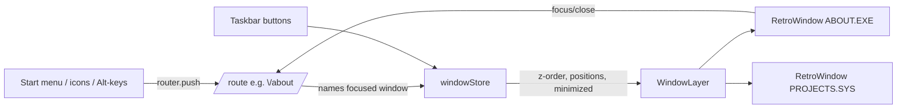

# 04 — Window Manager, Taskbar, Navigation Model, Responsive Behavior

Phase 1 · Depends on: [01-foundation](./01-foundation.md), [02-crt-shell](./02-crt-shell.md) · Unblocks: every windowed section (docs 05, 07–14)

---

## 1. Mission

Windows are how ATHARVA.RUNTIME presents everything (§6.2): every section opens as a movable retro window over the desktop, and every window is a real URL (§6.2, §29). This doc owns the window system, the taskbar/status bar (§6.3), the navigation model (§20 — icons, Start menu, keyboard shortcuts; the terminal is [doc 12](./12-terminal.md)), and the responsive strategy (§24), where windows become full-screen stacked views on mobile.

## 2. Deliverables

- `src/components/windows/RetroWindow.tsx`, `TitleBar.tsx`, `Dialog.tsx`.
- `src/components/desktop/WindowManager.tsx`, `Taskbar.tsx`, `StartMenu.tsx`.
- `src/stores/windows.ts` — window registry + z-order.
- Route plumbing: window routes as children of a shared `/desktop`-rendering layout (`src/app/(os)/layout.tsx`), per the model below.
- `src/lib/shortcuts.ts` — global keybindings (§20.4).

## 3. Technical design

### 3.1 URL ↔ window model (the load-bearing decision)

All OS-feeling routes live in one route group that always renders the desktop underneath:

```text
src/app/(os)/layout.tsx        renders <Desktop/> + <Taskbar/> + <WindowLayer/>
src/app/(os)/desktop/page.tsx  no window open
src/app/(os)/about/page.tsx    → opens ABOUT.EXE window containing this page's content
src/app/(os)/experience/[...]  → EXPERIENCE.DIR window, etc.
```

- The **URL names the focused window**; `windowStore` may keep *additional* windows open client-side (overlap per §6.2). Focusing a window does `router.push` (shallow) to its route; closing the focused window navigates to the most-recent still-open window's route, or `/desktop`.
- **Hard navigation / deep link** to `/about` renders desktop + ABOUT.EXE open and focused — server-rendered content inside the window shell, so SEO sees full content (§29).
- Window content is a server component; `RetroWindow` chrome is a client component wrapping it.



### 3.2 `windowStore`

```ts
interface WindowState {
  id: WindowId               // 'about' | 'experience' | ... (registry keyed to routes)
  route: string; title: string; icon: IconId
  pos: {x,y}; size: {w,h}; zIndex: number
  minimized: boolean; maximized: boolean
}
interface WindowsStore {
  windows: Record<WindowId, WindowState>; focusOrder: WindowId[]
  open(id, opts?); close(id); focus(id); minimize(id); toggleMaximize(id)
  move(id, pos); resize(id, size)
}
```

Positions cascade (+24px offsets) on open; persisted per-session (sessionStorage) so reloads keep the workspace.

### 3.3 Window behavior (§6.2)

- Drag by title bar (Framer Motion `drag`, constrained to screen bounds minus 32px so titles stay reachable); no drag on mobile (§24).
- Chrome per §6.2: `┌─ ABOUT.EXE ── [–][□][×]` — title, minimize, maximize, close as real buttons with labels.
- Active window: brighter title bar (`--text-bright` bg); inactive dimmed. Click-anywhere focuses.
- Double-click title bar maximizes (§6.2); `Esc` closes active window (§20.4).
- Minimize animates into its taskbar button (reduced-motion: instant).
- A11y: each window is `role="dialog"` with `aria-labelledby` (non-modal — desktop stays interactive); focus moves into the window on open and returns to the opener on close; internal focus not trapped, but F6 cycles window ↔ taskbar ↔ desktop icons.

### 3.4 Taskbar / status bar (§6.3)

```text
[ START ]  ABOUT.EXE  PROJECTS.SYS ...        GPU:78%  NET:OK  ♪  CRT  17:42
```

- Left: Start button + one button per open window (focused = pressed style; click = focus/restore).
- Right tray: GPU load, HBM %, NET state, uptime, sound toggle, DisplayModeToggle (doc 02), local time. Values come from `telemetryStore` (doc 05) — decorative but **reactive to interactions** (§6.3): opening GPU Lab raises "GPU load", running a simulation spikes it, etc. Tray is `aria-hidden` except the two real controls (sound, display) — fake telemetry must not pollute the a11y tree.
- Mobile: taskbar becomes a bottom navigation bar (§24) — Start, back-to-desktop, and the current window title.

### 3.5 Start menu (§20.2)

```text
PROGRAMS  →  ABOUT.EXE · EXPERIENCE.DIR · PROJECTS.SYS · GPU_LAB.EXE · PERFMON.EXE · MEMORY.MAP
DOCUMENTS →  FIELD_NOTES · INCIDENTS.LOG · TRANSMISSIONS.LOG · RESUME.PDF
SYSTEM TOOLS → TERMINAL · CAREER DEFRAG · VISITOR BENCHMARK · REPLAY BOOT
FIELD NOTES  (top-level shortcut)
CONTACT
SHUT DOWN    → returns to unpowered state at /
```

Keyboard: opens with `Start` button focus + Enter, arrow-key navigable menu (`role="menu"`), Esc closes.

### 3.6 Keyboard shortcuts (§20.4)

`ALT+A/E/P/G/B/R/C` → about/experience/projects/gpu-lab/blogs/resume/contact; `ESC` close active window; `~` opens terminal (handled by doc 12 but registered here). Registered in `shortcuts.ts` with an in-app cheat-sheet dialog (`?` key); all shortcuts suppressed while typing in inputs/terminal.

### 3.7 Responsive model (§24 — primary owner)

| Viewport | Behavior |
|---|---|
| Desktop ≥ 1024 | Full movable/overlapping windows, drag, maximize |
| Tablet 640–1023 | CRT frame retained; windows snap to a 1–2 column grid (no free drag; drag gesture snaps between columns) |
| Mobile < 640 | `AC-90 POCKET TERMINAL` (doc 02): each window route is a full-screen stacked view; bottom nav; no drag; optional horizontal "card insertion" transition between views (reduced-motion: fade); blogs default to clean reading mode (§24, enforced in doc 13); reduced 3D complexity flag passed down (docs 10/11) |

Same routes, same content components at every size — only the window chrome layer changes (a `useViewportMode()` hook selects chrome).

## 4. Creative direction

- Window chrome is Windows 3.1 × early-UNIX (§1): 1px double borders, chunky title bars in the Display font, controls rendered as ASCII-style glyphs `[–][□][×]` with real hit areas.
- Open/close animation: 2-frame "wireframe zoom" rectangle (like Win3.1's zoomrect), 120ms — cheap, era-correct, and reduced-motion-safe (skipped).
- `SHUT DOWN` plays the §4 narrative in reverse: windows close, desktop dims, `IT IS NOW SAFE TO TURN OFF YOUR WORKSTATION` — then `/` unpowered state.
- Taskbar clock uses the visitor's real local time (§6.3) — a tiny honesty detail that sells the "living machine".

## 5. Dependencies

Docs 01 (tokens, stores, fonts), 02 (shell). Consumers: 05 (desktop renders under WindowLayer), 07–14 (every section is window content), 12 (terminal window + `~` key).

## 6. Acceptance criteria

- [ ] Open ABOUT.EXE and PROJECTS.SYS; drag, overlap, focus-switch (URL follows focus), minimize to taskbar, restore, maximize via double-click, close with Esc — all work and survive reload (session persistence).
- [ ] Deep link `curl /experience/deloitte` returns full case-study HTML inside window markup (view-source verifiable).
- [ ] Back/forward buttons walk focus history correctly without duplicating windows.
- [ ] All §20.4 shortcuts work; `?` shows the cheat sheet; shortcuts inert while typing.
- [ ] Start menu fully keyboard-operable; SHUT DOWN reaches the unpowered state.
- [ ] Tablet snap and mobile stacked modes verified at 768px and 390px; no drag affordances on touch-mobile; bottom nav present.
- [ ] axe: windows announce as named dialogs; focus moves in on open, restores on close; fake telemetry absent from a11y tree.
- [ ] 60fps drag on a mid-range laptop (transform-only movement, no layout thrash — verified in DevTools performance trace).

## 7. Risks & fallbacks

| Risk | Fallback |
|---|---|
| Multi-window + URL-focus model confuses back-button semantics | Degrade to single-window mode (opening a window closes the previous) — §34 Phase 1 only requires that; multi-window becomes a Phase 2 enhancement flag |
| Framer Motion drag + shallow routing causes jank on focus change | Decouple: focus updates store synchronously, URL update debounced 150ms via `history.replaceState` |
| Non-modal dialog pattern trips screen readers | Fallback ARIA pattern: windows as labeled `region`s with a windows-list landmark; test with NVDA + VoiceOver before choosing |
| Session-persisted window layout goes stale/broken | Versioned storage key (`ac90:ws:v1`) + reset path in SYSTEM TOOLS ("REBUILD DESKTOP") |
