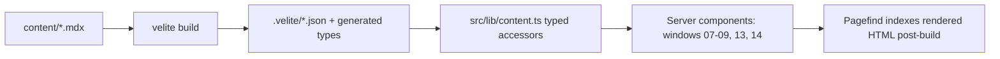

# 06 — Content Architecture: Velite Schemas + MDX Pipeline

Phase 0 · Depends on: [01-foundation](./01-foundation.md) · Unblocks: [07](./07-about-skills-resume.md), [08](./08-experience.md), [09](./09-projects.md), [13](./13-field-notes.md), [14](./14-incidents-and-transmissions.md)

---

## 1. Mission

Content is the payload the retro shell exists to deliver (§33: "The site must never allow visual design to hide the actual engineering work"). This doc builds the typed content layer: Velite schemas for the four §28 content types plus transmissions (§17), the MDX pipeline, folder layout, and the confidentiality-labeling convention (§14.3) that keeps every synthetic number honest.

## 2. Deliverables

- `velite.config.ts` — five collections with Zod schemas.
- `content/` tree: `experience/` (6 docs), `projects/` (5), `incidents/` (6), `blogs/` (8), `transmissions/` (n).
- `src/lib/content.ts` — typed accessors (`getExperience(id)`, `allBlogsSorted()`, category filters, related-content resolution).
- MDX component registry `src/components/blogs/mdx-components.tsx` (shells here; components themselves in doc 13).
- `ConfidentialityNote` component + lint rule (see §3.4).
- Build wiring: Velite runs before `next build`; output committed types give autocompleted frontmatter.

## 3. Technical design

### 3.1 Collections (schemas transcribe §28 into Zod)

**experience** (§28.1): `id (slug), company, role, date_start, date_end (nullable = present), location, summary, mission, scale, responsibilities[], decisions[], architecture (mdx-able), performance_work[], incidents[] (refs to incident ids), outcomes[], metrics[] {label, value, confidential: boolean}, technologies[], confidentiality_note?`

**project** (§28.2): `id, title, version, status (enum: PRODUCTION|BETA|PROTOTYPE|ARCHIVED), summary, problem, users, inputs[], outputs[], architecture, technical_decisions[], tradeoffs[], metrics[], failure_modes[], stack[], repository?, demo? (route of the doc-11 tool, e.g. "/projects/gpu-capacity-planner#run"), screenshots[]`

**blog** (§28.3): `title, slug, date, updated?, category (enum of §16.3), tags[], difficulty (1–5, rendered "LEVEL n"), read_time (computed by a Velite transform, not hand-set), summary, hero_diagram?, featured, draft, related_projects[], related_posts[]` + computed `doc_id` (`FN-004` style, from ordinal — §16.4 metadata block).

**incident** (§28.4): `id (INC-001…), title, severity (SEV1–SEV4), system, symptoms[], signals[], hypotheses[], root_cause, fix[], validation[], outcome[], lessons[]` — body MDX holds the long-form INVESTIGATION narrative (§15.3's INVESTIGATION field is prose, not frontmatter).

**transmission** (§17.2): `id (TRANSMISSION-001…), event, date, session_title, audience, abstract, slides?, video?, takeaways[], photos[], status (enum: DECODED|SCHEDULED|ARCHIVED)`

All schemas use `s.slug`, `s.isodate`, `s.mdx()` Velite primitives; cross-references (`incidents[]`, `related_projects[]`) validated at build time — a broken ref fails the build.

### 3.2 Data flow



Everything is static at build time (§26: blogs statically generated, text server-rendered). No CMS in v1 (§27 lists CMS as optional); the content folder *is* the CMS.

### 3.3 Authoring conventions

- Filenames: `content/experience/deloitte.mdx`, `content/incidents/inc-001.mdx`, `content/blogs/gpu-utilization-is-lying.mdx` — slug = filename.
- ALL-CAPS terminal-style field *rendering* (e.g. `ADOPTION........ 6 CLIENT ENGAGEMENTS`) is a presentation concern — frontmatter stays normal-case; dot-leader formatting is done by components.
- Draft workflow: `draft: true` blogs build locally, excluded from prod (`NODE_ENV` filter in accessors) and from Pagefind.

### 3.4 Confidentiality convention (§14.3)

Any metric that is reconstructed/normalized sets `confidential: true` in its metrics entry; components rendering it MUST attach the label:

```text
REPRESENTATIVE WORKLOAD — NORMALIZED FOR CONFIDENTIALITY
```

Enforcement: `ConfidentialityNote` is the only component that renders the label (single source of copy), and a Vitest content test walks all collections asserting (a) every `confidential: true` metric appears in a doc whose template renders `ConfidentialityNote`, and (b) `confidentiality_note` is present on all experience docs for regulated clients (deloitte, bank-of-america, humana).

## 4. Creative direction

- Frontmatter is boring on purpose; the machine voice (dot leaders, ALL CAPS, `DOCUMENT ID` blocks) is applied by the rendering layer so a future redesign never has to migrate content.
- `read_time` computed at 200 wpm + 12s per diagram — so the `8 MIN` labels in §16.2 stay honest automatically.
- Every collection gets one **seed document** in Phase 0 written to exercise every schema field (the Deloitte experience, the capacity-planner project, INC-001 — §15.4 gives its content, blog post 01, and one GTC transmission) so downstream docs develop against real shapes.

## 5. Dependencies

Doc 01 (Velite installed, build scripts). Downstream: docs 07–09/13/14 consume accessors; doc 11 links project frontmatter `demo` routes; doc 15's SEO reads frontmatter for OG/structured data.

## 6. Acceptance criteria

- [ ] `pnpm velite` builds all five collections; generated types are consumed with autocomplete in `content.ts` (typecheck proves it).
- [ ] Invalid frontmatter (missing required field, bad category enum, broken `related_projects` ref) fails the build with a pointed error.
- [ ] Seed docs exist for all five types and render through a scratch route.
- [ ] `read_time` and `doc_id` computed fields verified by unit test.
- [ ] Confidentiality tests (§3.4) pass; the label string exists in exactly one component.
- [ ] Draft blogs excluded from production build output and search index.

## 7. Risks & fallbacks

| Risk | Fallback |
|---|---|
| Velite hits a Next 15/webpack integration snag | Velite is framework-agnostic (runs as a pre-build CLI step) — decouple fully: `velite && next build`, watch mode via `concurrently` in dev. If Velite itself dies as a project, schemas are plain Zod and migrate to contentlayer2 or a 50-line custom loader with the same output shape |
| Schema churn as sections 07–14 get built | Schemas versioned in this doc; changes require editing this doc first (same rule as master plan locked decisions) to prevent drift between plan and code |
| Real content unavailable/confidential for some fields | Fields are optional where §28 allows; the §14.3 label plus normalized numbers is the designed answer — never fabricate unlabeled metrics |
| Author friction with long frontmatter | Provide `content/_templates/*.mdx` template per type with every field commented |
